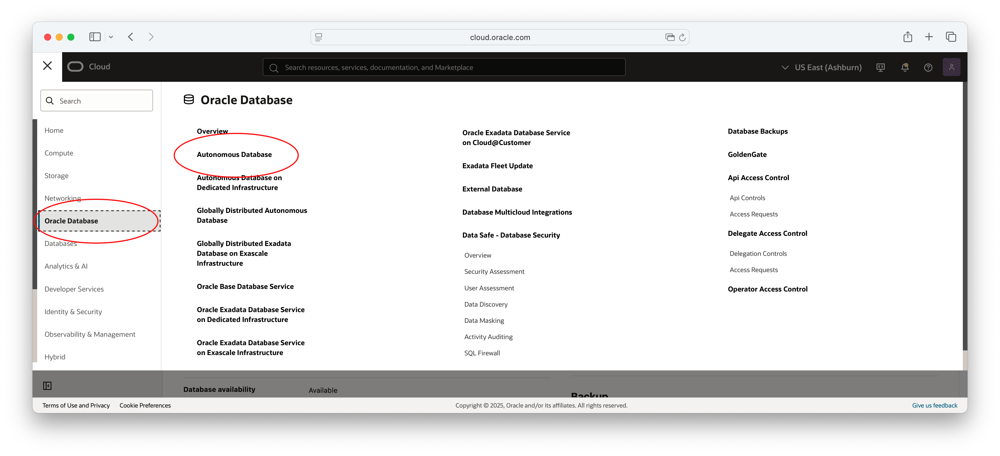
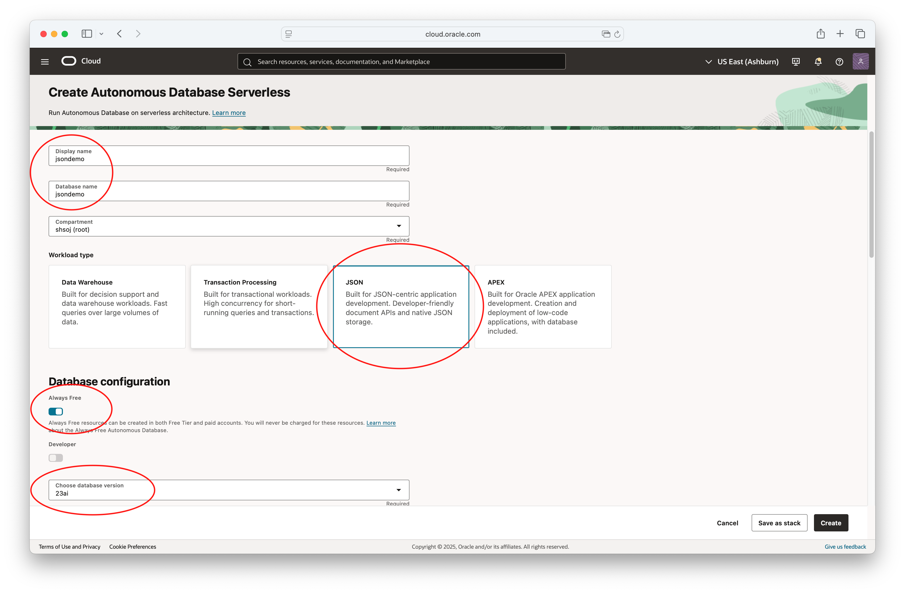
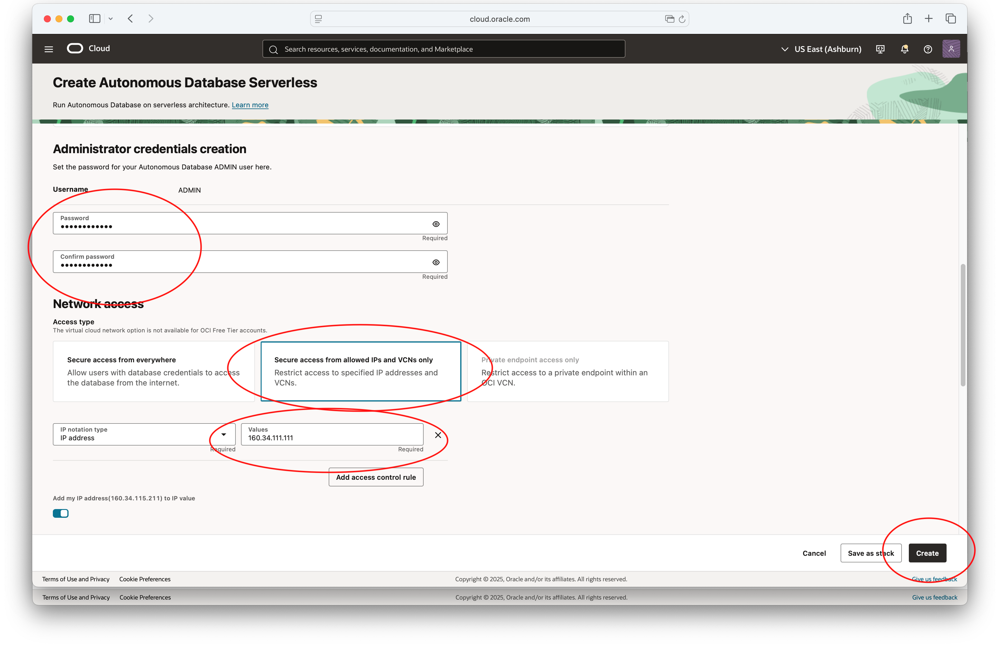
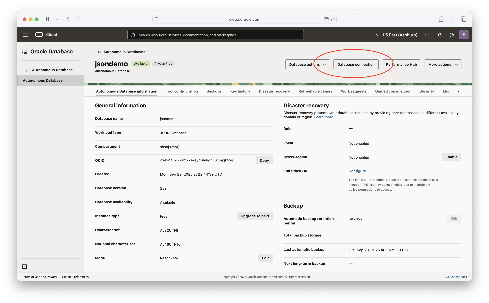
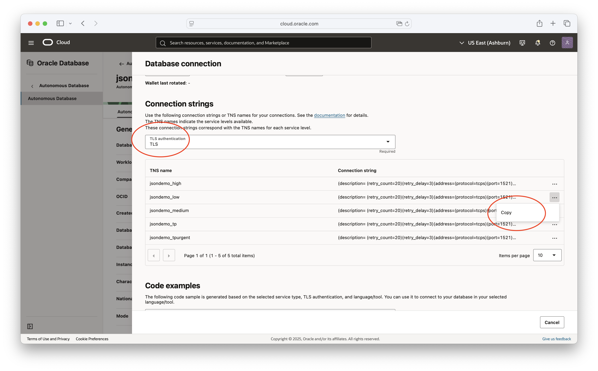
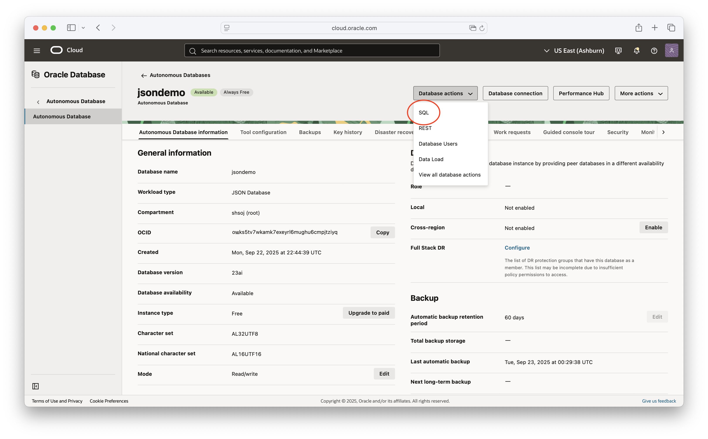
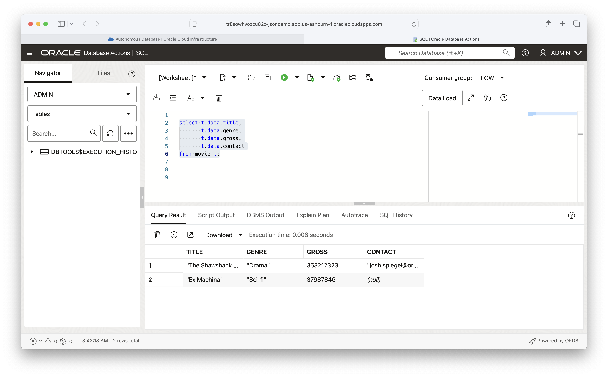

# Creating a free Autonomous Database

## Sign-up for a free account

 Go to http://cloud.oracle.com 

 It will ask for a credit card but this is just for identification.  It will not charge your card without authorization.  There is a 30-day trial period where you will receive paid resources.  After the period ends, you are only able to provision always-free resources.

## Select Oracle Database -> Autonomous Database



## Select "Create Autonomous Database"

* Give the database a name
* Select JSON for the workload type
* Turn on the always-free option
* Select database version 23ai
* Select "Secure access from allowed IPs" and add your IP
* Enter a password for the ADMIN user





## Find your connection string

Click on "Database Connection"



Select "TLS" and copy the "low" connection string:



This connection string can be used to run the examples.

## Trying SQL/JSON

Click on "Database Actions" > "SQL"



Execute SQL:



```
create table movie (data json);


insert into movie values (
  json {
    'title' : 'The Shawshank Redemption', 
    'genre': 'Drama',
    'gross' : 353212323, 
    'contact' : 'josh.spiegel@oracle.com'
  }
);

insert into movie values (
  json {
    'title' : 'Ex Machina', 
    'genre': 'Sci-fi',
    'gross' : 37987846
  }
);

select * from movie;

select t.data.title,
       t.data.genre,
       t.data.gross,
       t.data.contact
from movie t;

select t.data.title,
       t.data.genre,
       t.data.gross,
       t.data.contact
from movie t
where t.data.contact = 'josh.spiegel@oracle.com';

select t.data.genre, count(*), sum(t.data.gross) 
from movie t
group by t.data.genre;


    
```


